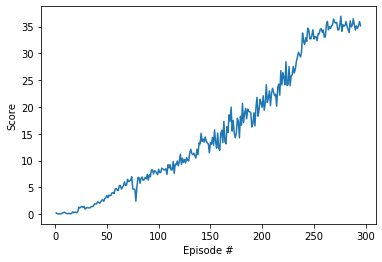

# Deep Deterministic Policy Gradient (DDPG) for Continous Control
**DDPG** is implemented to train one agent/20 agents (2 links robot arm) to track a ball.

# Learning Algorithm
The DDPG algorithm is composed of `ddpg_agent.py` and `model.py`. This python file includes DDPGAgent and ReplayBuffer. DDPG is a type of Actor-Critic algorithm. The optimal algorithm is Adam.

**Model of Actor Network**

- input (state) size: 33
- output (action) size: 4
- 2 hidden layers + one output layer
- each hidden layer has 256 hidden units for first layer, 128 hidden units for second layer and is followed by a `ReLU` activation layer
- We have a batch normalization layer after the first layer
- output layer is followed by a tanh activation layer

**Modle of Critic Network**

- input (state) size = 33
- output (action) size = 1
- 2 hidden layers + one output layer
- each hidden layer has 256 hidden units for first layer, 128 hidden units for second layer and is followed by a `ReLU` activation layer
- output layer is followed by a linear activation unit

#### Hyperparameters
|replay buffer size |int(1e6)       |
| -------------------------------------------| ---------------------------|
| minibatch size | 128 |
| discount factor GAMMA | 0.99 |
|  learning rate of the actor    | 1e-4| 
|  learning rate of the critic    | 5e-4| 
| L2 weight decay | 0 |

Remark 1: When setting the learning rate for actor and critic, the values should not be too larger otherwise it might not converge.

Remark 2: mini-batch size should not be too large too.

# Results
#### Untrained Agent

#### Trained Agent
![Trained agent] (Images/Trained_agent_20reachers.gif)

#### Rewards
This is plot of rewards when training.
At Episode 295, agent performance met the criteria and stopped training.
(mean scores of last 100 episodes is above +30)

# Ideas for Future Work

- Prioritized Replay ([paper](https://arxiv.org/abs/1511.05952)) and PPO ([paper](https://arxiv.org/abs/1707.06347)) are two potential methods to generate better results.

# Trained model
20 agents
[Trained model (actor)](./checkpoint_actor.pt)
[Trained model (critic)](./checkpoint_critic.pt)
